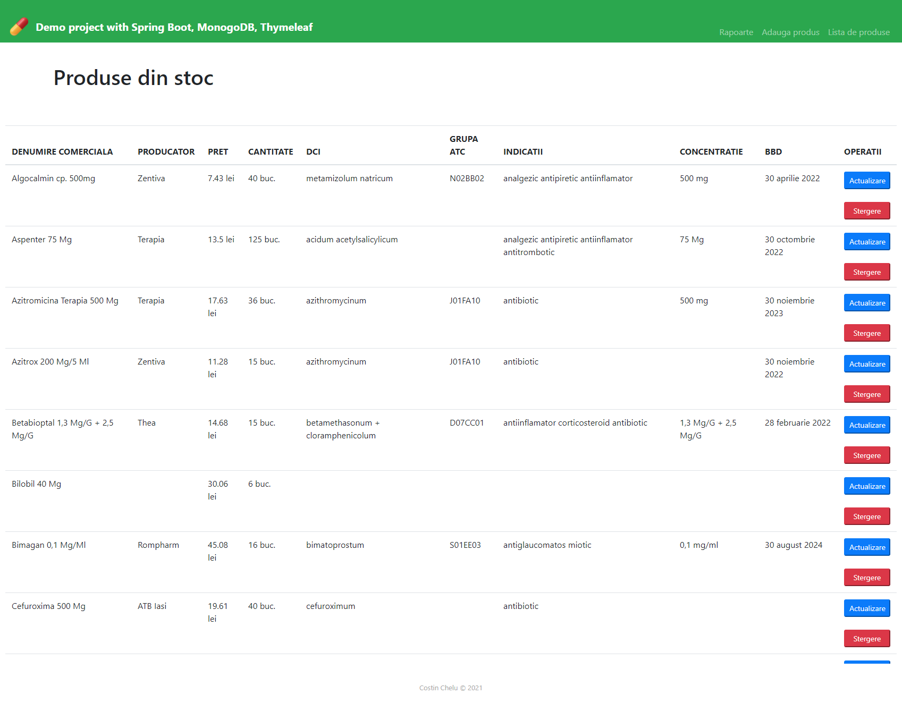
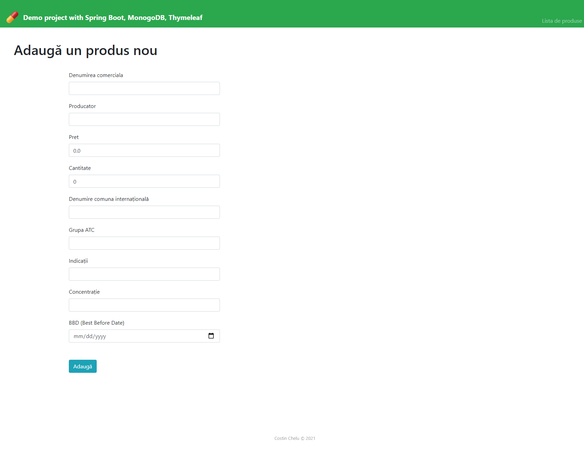
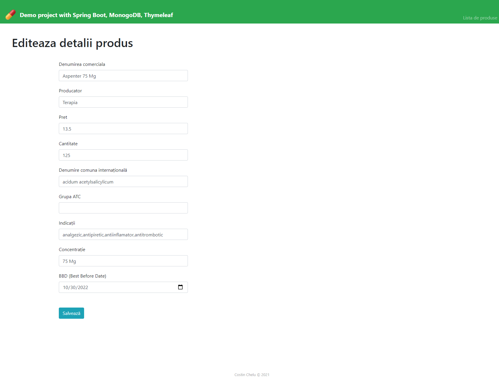
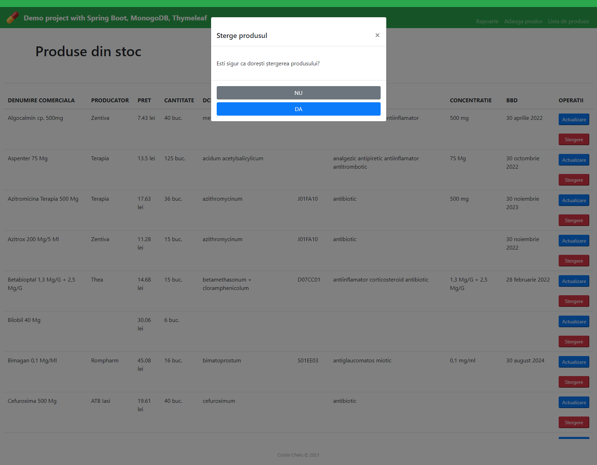
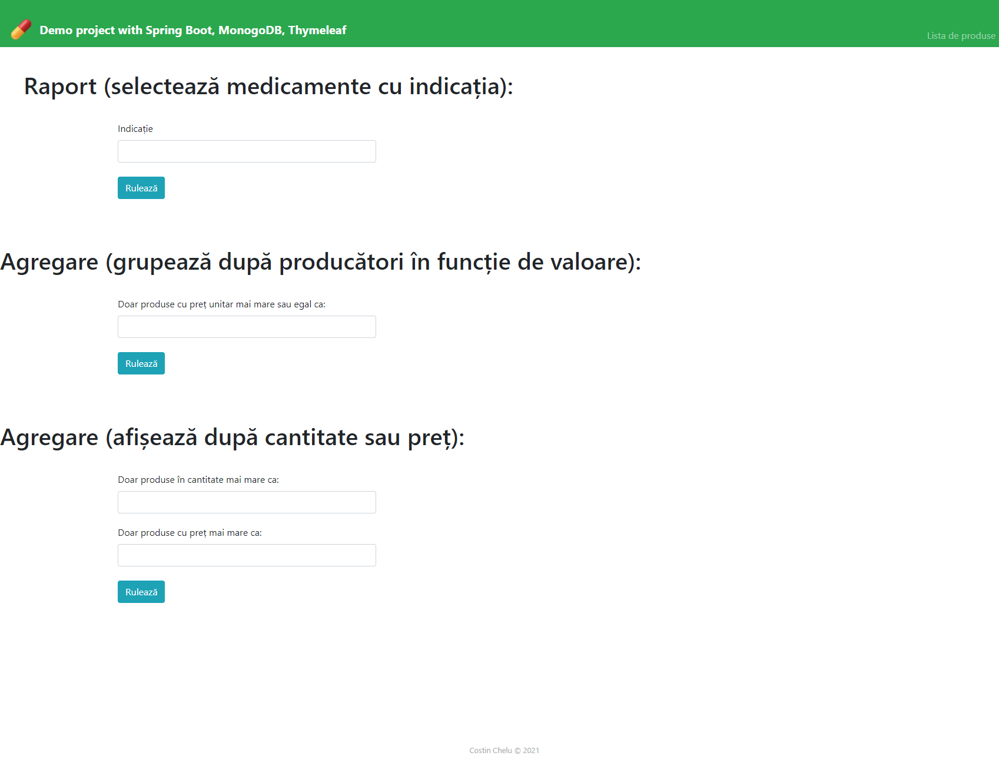
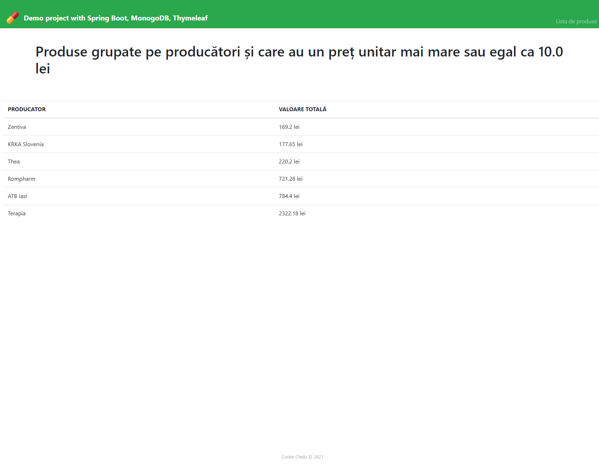
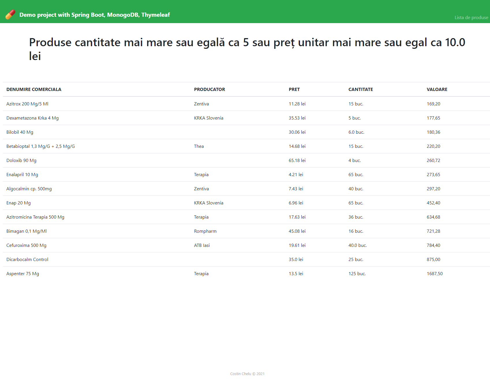
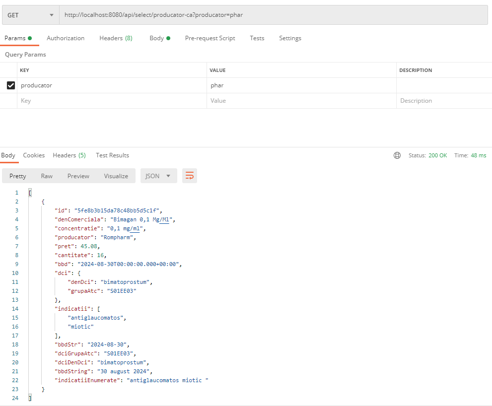

# SPRINGFARMA

Demo project using:
  - Spring Boot (backend)
  - MongoDB (data persistence)
  - Thymeleaf (server-side template engine)
  
It is used as a demonstration for CRUD operations in MongoDB and also for custom interrogations and aggregations specific to this type of NoSQL database. The original project uses MongoDB Atlas for providing the database (Database As A Service). 
I didn't provide the original connection string for security issues but you can find all database operations and objects in the root of the project. Define a connection string in `application.properties` file located in `resources` folder. It should look like this:

```xml
spring.data.mongodb.uri=mongodb+srv://<USER>:<PASSWORD>@<DB_ADDRESS>/<COLLECTION>?retryWrites=true&w=majority
```

The address used to access the app is `http://localhost:8080/select/toate`. I also made a REST API with a number of endpoints. Example endpoints can be found in `ProdusRestController.java`.

## SCREENSHOTS

Reading


Adding


Updating


Deleting


Reports


Aggregation


Interrogation


REST operation

